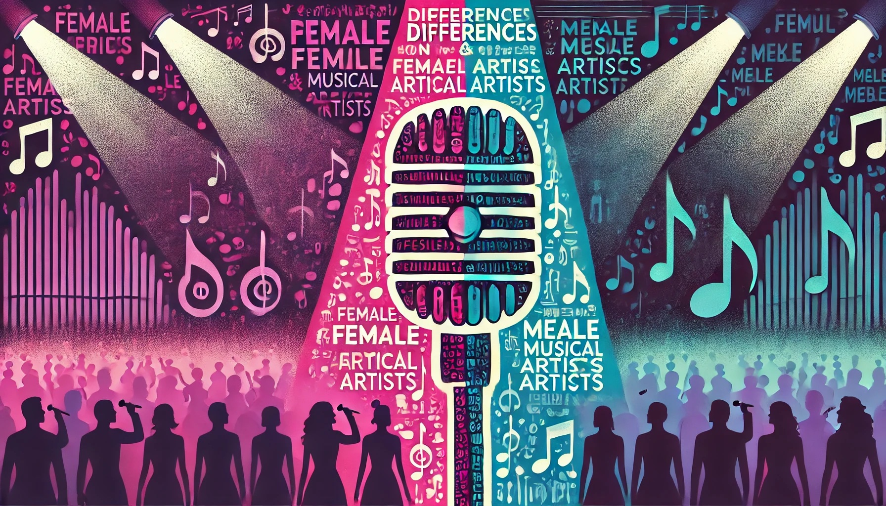

# W10 Summative

**AUTHOR:** Defne Ece Yavuz

**CANDIDATE NUMBER:** (THIS IS A 5-DIGIT NUMBER THAT LSE GIVES YOU EVERY YEAR. **DO NOT FORGET TO ADD THIS HERE.** IT IS IMPORTANT!)

- [ ] Add a brief description of what this repository is about, what you wanted to discover when you started it and what you ended up doing/discovering

- [ ] Add instructions for how to run the code to replicate the results

### Description
This repository is a summative assignment for the class DS105: Data for Data Science. In summary, 

Initially, my goal was to do an exploratory analysis of what defined "main pop girl" music - I wanted to get a list of top tracks by "main pop girls" such as Sabrina Carpenter, Chappel Roan, Olivia Rodrigo etc. and inspect their audio features. However, due to the deprecation of these endpoints in the Spotify API, I had to reformulate my research aim and question. 

So, I ended up gathering data through two Spotify user-created playlists, "Pop Hits 2000s - 2024", to see which artists featured most over 2000-2024 in top pop hits tracks, and "girly pop songs", to diversify and reduce bias in the dataset, as due to recent API restrictions I can't use Spotify-created playlists and I wanted to get an unbiased, unopinionated sense of "top hits". So, I obtained data through two user-created playlists with different vibes/aesthetics.

### Background/Literature Review

### Research Question
Do the lyrics of male/female 

### Hypothesis
Based on my brief literature review, I am predicting that:
H0: There won't be any differences in themes between top pop hits by male and female artists.
H1: 

### Plan
1) Obtain top hits from 2000-2024
2) Obtain girly pop/"main pop girl" tracks
3) Combine these two playlists
4) Get top 5 female and male artists (decided through how many of their songs feature on the playlists)
5) Get these artists' top 10 tracks
6) Create a database of these songs
7) Get the lyrics to to these songs and put them in a database
8) Analyze these top 10 songs' lyrics to see whether they have any common themes or differences

### Table of Contents
| NB | Name | Content |
| :--: | :--- | :--- |
| 01 | Data Collection |  |
| 02 | Data Processing |  |
| 03 | Data Visualisation |  |

### How to recreate the Python environment
1) Install pyenv through running `brew install pyenv` (for Mac) `or curl https://pyenv.run | bash` (for Linux)
2) Install the required Python version by running `pyenv install 3.12.2` and then `pyenv local 3.12.2`
3) To create and activate the virtual environment, run `python -m venv venv` and then `source venv/bin/activate` (for Mac/Linux) and `.\venv\Scripts\activate` (for Windows)
4) Run pip install -r requirements.txt, where requirements.txt is a document containing all the required libraries (e.g., pandas) and the versions to be used

### How to obtain Spotify and Genius credentials and where to put them
To be able to run the code and obtain API data: 
1) Create an account or login to the [Spotify Developer Dashboard](https://developer.spotify.com/dashboard) and [Genius API page](https://genius.com/api-clients)
2) Create an app, name it (e.g., My App), describe it, and use the example Redirect URI link
3) Click on your My App Home and navigate to settings
4) Copy the Client ID and Client Secret 
5) Create a .env file and store the credentials there (as CLINET_ID and CLIENT_SECRET)
6) Install python-dotenv by running `pip install python-dotenv`
7) Import the .env file by running `From dotenv Import load_dotenv`
8) Write a get_token() function in a separate file, auth.py, to streamline access token calling and using. Import the function through `From auth.py Import *` and utilize when calling endpoints

### How to Run the Code to replicate the results
